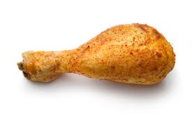

\newpage

```{r setup, include=FALSE}
knitr::opts_chunk$set(echo = TRUE)
```

# Animal Bliss

## How Much Does The Average Chicken Weigh?

### Adesso cominciamo davvero
\color{blue}[Website](https://www.animalbliss.com/how-much-does-a-chicken-weigh/#:~:text=Chickens%20can%20be%20divided%20into,weigh%20less%20than%20two%20pounds.)\normalcolor

Keeping chickens is a rewarding **\color{yellow}{experience}**\normalcolor. Not only do they produce *\color{red}{tasty }*\normalcolor eggs for the kitchen table, but chickens have surprisingly ***\color{blue}{vibrant }***\normalcolor personalities and are very social animals. They can quickly start to feel like a member of the family.

But while a tiny chicken running around the backyard might seem like no problem at all, some chickens can get rather big. Exactly how big depends on their specific breed. Larger breeds can weigh as much as 10 pounds, while small bantam chickens can weigh less than two pounds. How big your chickens will get will dictate how many you can comfortably keep in the space you have.

With that in \Huge mind\normalsize, we'll look at the average size of the most popular chicken breeds, using weight as an indicator of size. We will also go through how much space you need to keep a chicken well, based on their size.

## Cochin chickens

Cochin chickens are known for their friendly manner and puffy plumage. They tend to be lazy, so they don't need too much space, and they enjoy getting attention from people of all sizes. This has made them popular pets, even though they only lay one or two eggs a week.

They are one of the giant chicken breeds, with the hens weighing around 8.5 pounds on average and the roosters an average of 11 pounds

They have a life expectancy of between five and eight years.

## Brahma chickens

Brahma chickens are often known as gentle giants because they are big but friendly birds. They have soft feathers that you can snuggle up against, and this also helps them do relatively well in colder climates. They look regal with their large size and beautiful plumage, plus they will produce three to four eggs for you per week.

Brahma hens reach a respectable eight pounds in weight, while roosters are noticeably larger at around 10 pounds. Specially bred bantam versions of this chicken are sold, also.

The full-size birds generally have a lifespan of around eight years.

## Orpington chickens

Orpington chickens are known to be both docile and broody, so they will sit on their eggs all day. But they are also very social and love attention so will enjoy being part of a family. They are known for the interesting colors of their plumage with pallets such as jubilee diamond and lemon cuckoo. They are good egg layers,producing between three and five eggs each week.

This is another very large breed, with hens averaging around eight pounds and roosters around 10 pounds. Bantam versions of the breed are also widely available.

They have a life expectancy of around eight years.

# How Much Space Do My chickens Need?

How much space[^1] your chickens need to live comfortably depends principally on their size, but temperament can also make a difference. Lazy chickens who prefer to sit for most of the day and that are docile can deal with a little less space than active chickens or those with a more aggressive nature[^2]. But size can be used as a strong guide for determining the amount of space you need.

[^1]:What is space we still don't know honestly
[^2]:Also what is nature we still don't know 

# Come fare le liste 
- Sinceramente 
- Quella di Geolier 
- Casa mia
   - Elenco annidato 
   - Elenco rannicchiato
- La noia 

1. La noia
2. Sinceramente 
3. Quella di Geolier 


Una canzone di Ghali, presentata a Sanremo 2024.

>  Il prato è verde, più verde, più verde, sempre più verde (sempre più verde). 
Il cielo è blu, blu, blu, molto più blu (ancora più blu)

# Come inserire le immagini 
MARKDOWN: In questo modo non abbiamo modo di controllare le dimensioni, la posizione etc




RMARKDOWN: In questo altro modo invece possiamo gestire: la caption, l'allineamento, e la larghezza, l'altezza invece viene sempre
aggiustata in proporzione da r. La percentuale fa riferimento alla grandezza della pagina (50% significa il 50% della 
larghezza della pagina)
```{r, fig.cap = "always the dead chicken", fig.align="center", out.width="60%"}
knitr::include_graphics(path = "images/pollo.jpeg")
```


# Come scrivere le citazioni 
Esempio: 
Recenti studi [@epifania2020implicit] dimostrano che il pollo è morto. Diversamente da questi, altri invece hanno studiato che il pollo può risorgere [@epifania2020dscoreapp]. La dottoressa Mastromatteo adora i polli  con la salsa barbecue [@scrimin2022effects]. 


# Come scrivere la matematica 
La famosa equazione di Einstein: 
$$3 +2 =5$$

# Come mettere le cross references 
install.packages("bookdown")
\@ref(type:label)


```{r}

```


\newpage
# References 
